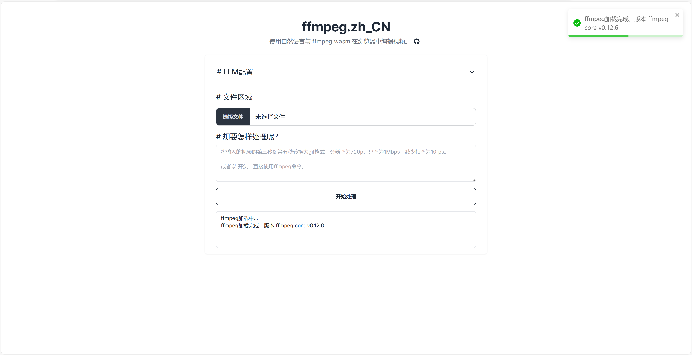

# ffmpeg.zh_CN

使用自然语言与 ffmpeg wasm 在浏览器中编辑视频。

使用Next.js开发，使用ffmpeg.wasm进行视频处理，使用LLM进行自然语言处理。

项目托管在vercel，地址：[https://ffmpeg-zh-cn.vercel.app](https://ffmpeg-zh-cn.vercel.app)

## 注意事项
- 第一次使用需下载ffmpeg.wasm
- 视频处理在浏览器中进行
- 最大处理2GB的视频
- LLM的api key保存在本地

## 本地运行
```bash
npm install
npm run dev
```

## License
MIT
